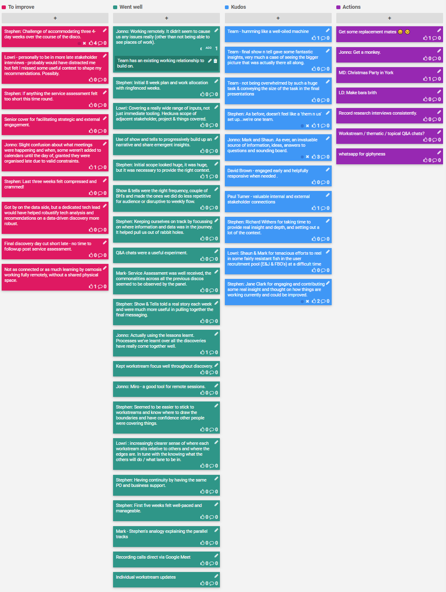

## 2020-05-14

## Actions

- Record research interviews consistently.
- Workstream / thematic / topical Q&A chats?
- [x] whatsapp for giphyness
- [ ] MD: Christmas Party in York
- [ ] MD: Get some replacement mates 😔 😕
- [ ] Jonno: Get a monkey.
- [ ] LD: Make bara brith

## Kudos

* Team for humming like a well-oiled machine
- Team for final show n tell gave some fantastic insights, very much a case of  seeing the bigger picture that was actually there all along.
- Team for not being overwhelmed by such a huge task & conveying the size of the task in the final presentations
- As before, doesn't feel like a 'them n us' set up...we're one team.
- Mark and Shaun for, as ever, an invaluable source of information, ideas, answers to questions and sounding board.
- David Brown for being engaged early and helpfully responsive when needed .
- Paul Turner for valuable internal and external stakeholder connections
- Richard Withers for taking time to provide real insight and depth, and setting out a lot of the context.
- Shaun & Mark for tenacious efforts to reel in some fairly resistant fish in the user recruitment pool (E&J & FBO's) at a difficult time
- Jane Clark for engaging and contributing some real insight and thought on how things are working currently and could be improved.

## Went well

- Kept workstream focus well throughout discovery.
- Miro - a good tool for remote sessions.
- Seemed to be easier to stick to workstreams and know where to draw the boundaries and have confidence other people were covering things.
- increasingly clearer sense of where each workstream sits relative to others and where the edges are. In tune with the knowing what the others will do / what lane to be in.
- Having continuity by having the same PO and business support.
- First five weeks felt well-paced and manageable.
- Stephen's analogy explaining the parallel tracks
- Covering a really wide range of inputs, not just immediate tooling. Heckuva scope of adjacent stakeholder, project & things covered.
- Use of show and tells to progressively build up an narrative and share emergent insights.
- Initial scope looked huge, it was huge, but it was necessary to provide the right context.
- Working remotely. It didn't seem to cause us any issues really (other than not being able to see places of work).
- Initial 8 week plan and work allocation with ringfenced weeks.
- Show & tells were the right frequency, couple of BH's and made the ones we did do less repetitive for audience or disruptive to weekly flow.
- Keeping ourselves on track by focussing on where information and data was in the journey. It helped pull us out of rabbit holes.
- Q&A chats were a useful experiment.
- Service Assessment was well received, the commonalities across all the previous discos seemed to be observed by the panel.
- Show & Tells told a real story each week and were much more useful in pulling together the final messaging.
- Actually using the lessons learnt. Processes we've learnt over all the discoveries have really come together well.
- Individual workstream updates
- Recording calls direct via Google Meet

## To improve

- Challenge of accommodating three 4-day weeks over the course of the disco.
- personally to be in more late stakeholder interviews - probably would have distracted me but felt I missed some useful context to shape my recommendations. Possibly.
- If anything the service assessment felt too short this time round.
- Senior cover for facilitating strategic and external engagement.
- Slight confusion about what meetings were happening and when, some weren't added to calendars until the day of, granted they were organised late due to valid constraints.
- Last three weeks felt compressed and crammed!
- Got by on the data side, but a dedicated tech lead would have helped robustify tech analysis and recomendations on a data-driven discovery more robust.
- Final discovery day cut short late - no time to followup post service assessment.
- Not as connected or as much learning by osmosis working fully remotely, without a shared physical space.

