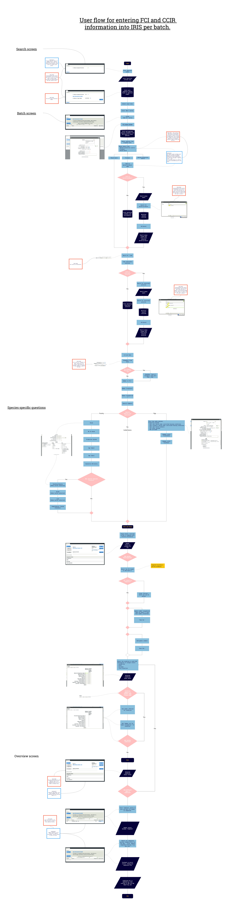

The interaction flow is an ‘as-is’ look at how IRIS works for an OV inputting FCI and CCIR information. In addition to the user journey,it highlights pain points and opportunities within the interface and overall user experience.

Images are available for download in a variety of sizes:
* [Small](uploads/iris/IRIS_user_flow_Sm.jpg)
* [Medium](uploads/iris/IRIS_user_flow_Med.jpg)
* [Large](uploads/iris/IRIS_user_flow_Lrg.jpg)
* [Vector (PDF, fully scalable)](uploads/iris/IRIS_user_flow_Vector.pdf)

# Key user pains and opportunities
## Search screen
**Pain**
* Inconsistencies with search functionality. Here the user must tab or click out of the input to search. When searching for market/producer the user clicks an icon.
* User must know the approval number of the plant to complete.

**Opportunity**
* Automate approval number for logged in user - we know where they are working, this could be auto-filled or have a list of recently used plants.

## Batch screen
### Data integrity
**Pain**
* Mixed batch is being used incorrectly and over 90% of throughput on IRIS is marked as mixed batch. This is down to a number of factors mainly because user can speed up filling in IRIS by using this shortcut.

**Opportunity**
* All digital system: Automate some data such as dates and numbers based on previously completed information. This could be based off the "Batch ID/Load" + Approval number + date i.e. we know a batch of X species arrived on XX/XX/20XX date for XYZ plant.

### Searching for market/producer/veterinarian**
**Pain**
* Inconsistencies with search functionality. The user must click the icon to search, on the initial system screen (search for plant) the user must tab or click out of the input to search.
* Inconsistent text sizing
* Error occurs as "slaughter to date" cannot be in the future, save button is disabled, however no feedback to this problem is said to the user.

## Overview screen
**Pain**
* When the user has entered data for the inspection area for Ante-Mortem, there is no feedback/visual cue on the table to indicate this.

**Opportunity**
* Give visual feedback that the inspection area has had data added to it.

**Pain**
* User has to wait for post-back to server to occur to hide completed batches.

**Opportunity**

* Toggle visability on the front-end to improve performance (this may be limited by what K2 allows).