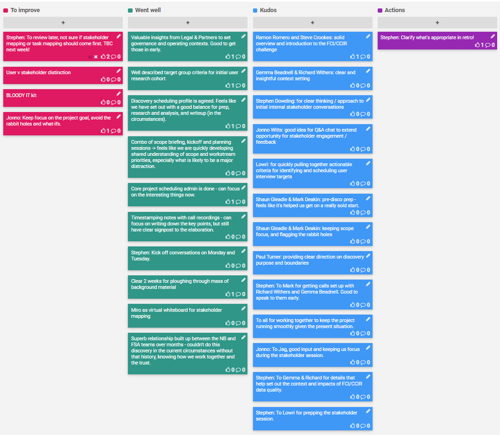
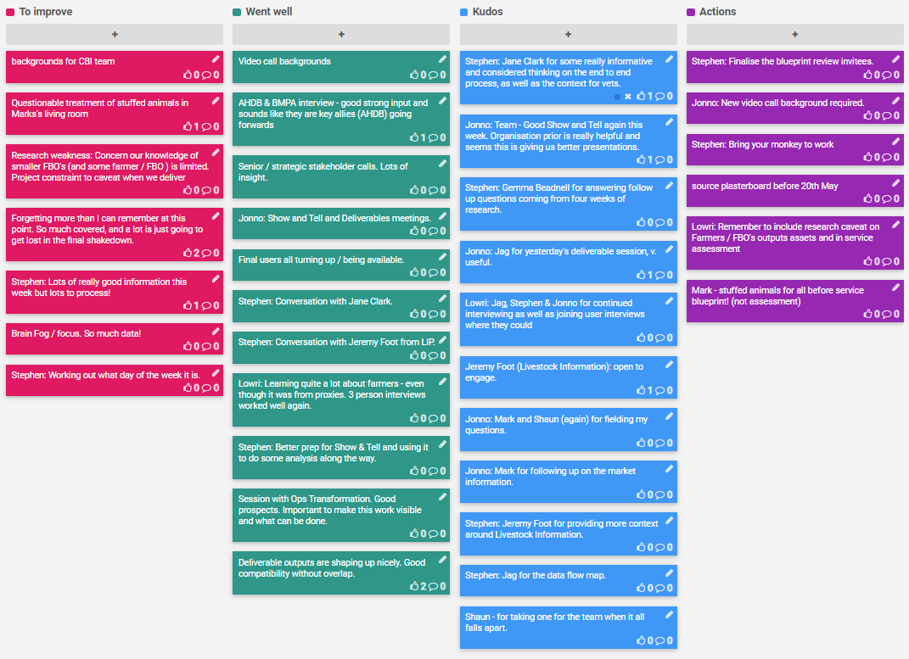
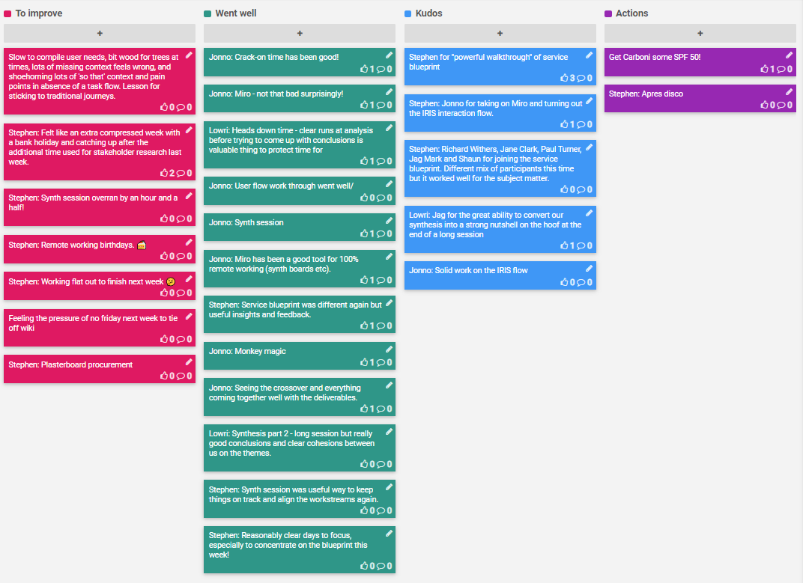

A retrospective is a ceremony held by an agile team at the end of each sprint to openly discuss what is going well and what needs improvement. It's a key activity to help the team iteratively improve their working culture.

## [Sprint 1 (23-27 Mar)](Sprint-1-Retrospective)

## [Sprint 2 (30 Mar - 3 Apr)](Sprint-2-Retrospective)

## [Sprint 3 (6-9 Apr)](Sprint-3-Retrospective)

## [Sprint 4 (14-17 Apr)](Sprint-4-Retrospective)

## [Sprint 5 (20-24 Apr)](Sprint-5-Retrospective)

## [Sprint 6 (27 Apr - 1 May)](Sprint-6-Retrospective)

## [Sprint 7 (4-8 May)](Sprint-7-Retrospective)

## [Full Discovery Retrospective](Discovery-Retrospective)
