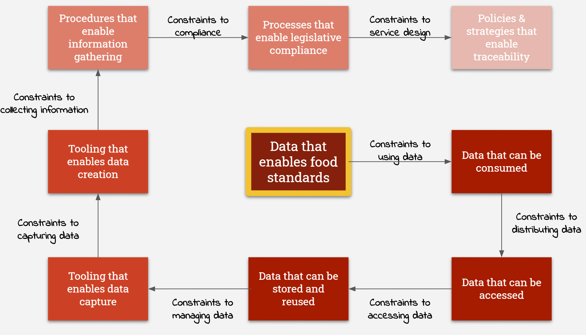

## Understand service constraints

Service constraints are factors that should be taken into consideration when designing, operating and improving workplace planning for meat plant inspections.

Constraints are not necessarily roadblocks or reasons not to do things; they provide a way to recognise concerns, potential clashes of interest, technical and process-related issues, and other factors that could prevent the service from being fully successful.

They enable a service team to either find ways to remove or reduce the constraint, or build an acceptance that there will be limitations to what the service can achieve.

Constraints could be:
* **Known knowns** - Things we know will have an impact and can clearly define.
* **Known unknowns** - Things we know will have an impact but can't clearly define at the moment.

## Identified service constraints

Click to open the source file: [Tracing FCI and CCIR service constraints](https://drive.google.com/open?id=1tyQUCWQ2J9hvNPcKYK-TAi8RBxvzFUqD)

To identify service constraints within the remit of this discovery, we have focussed on 'data that enables food standards' as an overarching outcome. Having mapped user journeys and process workflows, we have then identified a series of outcomes along the traceability journey and looked at the factors that must be considered to deliver each one.

This approach helps us to link the disparate factors from people, technology, processes, and governance that feed into FCI and CCIR in practice.

To deliver a successful service, the objective would then be to turn the direction of the constraints flow; to work on incremental changes around each constraint and to track service improvement over time.

### Service constraints and analysis

Constraint        | **Data that enables food standards**  
--- |  --- 
Description| Accurate, authentic, and timely data is a key tool in delivering initiatives to protect and improve animal health & welfare and food safety.

| Service Analysis                                             |
| ------------------------------------------------------------ |
| While user research has confirmed a real value and demand for inspection results data to assist with farm management and animal health improvements, there simply is no process or tracking in place to confirm how many primary producers are receiving inspection results data from their FBO. |
| Although user research suggests that inspections results that might indicate the presence of a reportable disease or other major issue do generate responsive and timely action, the regulations do not stipulate any timescales for the communication of inspection results.   There is no metric to measure how often or how quickly primary producers receive information about the health and welfare of the animals sent for slaughter. |

***

Constraint        | **Data that can be consumed**  
--- |  --- 
Description| Data has no real value if it can't be associated with creating better understanding, and/or informing better decisions. To allow that it must be usable in a way that is accessible to one or more defined audiences.

| Service Analysis                                             |
| ------------------------------------------------------------ |
| The traceability journey involves multiple consumers of the data at various points. The consumer at each point needs to be considered when designing the format and style of information being made available so that it can be easily taken on board and used as required. |
| The FSA's lack of visibility of the information provided by FBOs to producers makes it difficult to drive standards or measure usability of the inspection results data it has captured.  |
| The proliferation of FSA forms and alternative, FBO-devised ways of capturing FCI again makes it difficult to drive standards and consistency and to track whether information is fit for purpose and fit for use. Monitoring, such as it is, is largely dependent on anecdotal evidence and local responses.|

***

Constraint        | **Data that can be accessed**  
--- |  --- 
Description| Data has reduced value if it can't be accessed in a way that is relevant and readily available to one or more defined audiences.

| Service Analysis                                             |
| ------------------------------------------------------------ |
| Traceability data is being captured and stored in a number of different systems and locations with ownership split between the FSA and FBOs at different points in the journey.   There is also no one system of record; and no one piece of data is constant through the whole 'farm to fork' process meaning traceability is typically a complex process of piecing together food and animal history. |
| The fragmented way data is collated also means there are ownership, technology and access management dependencies at each stage of the traceability journey. |

***

Constraint        | **Data that can be stored and reused**
--- |  --- 
Description| Data is the raw material that combines to create information. Data has enhanced value if it can be maintained and can be repurposed to serve multiple information needs.

| Service Analysis                                             |
| ------------------------------------------------------------ |
| On the surface, inspection results are being stored and can be reused via the IRIS system; FCI is managed inconsistently and the information that leaves the holding of provenance can easily become 'lost en route' depending on the path animals take to the abattoir and particularly where that involves passing through a livestock market.   However inspection results captured in IRIS and the information that producers may receive are not the same thing and there is no effective tracking in place to understand how inspection results are reprocessed by FBOs to meet their own requirements (e.g. providing the level of food provenance detail demanded by retailers and consumers).   Elements of raw data are available but there is a lack of coordination with meeting the legal obligation to keep producers informed.|

***

Constraint        | **Tooling that enables data capture**  
--- |  --- 
Description| Data is being captured at a number of points in the process, and by any number of people and/or systems. Data capture tools should be fit for purpose and fit for use.

| Service Analysis                                             |
| ------------------------------------------------------------ |
| FCI is collected in an almost indeterminate number of ways. Although the FSA has produced model FCI forms and explained what information is required for each species, these are not prescriptive (and the regulations allow for data collection in paper and/or digital formats).   The way FCI is collected is either determined by the FBO and/or where third party assurance schemes provide alternative data collection tools and portals.  |
| From the FSA's perspective, IRIS is the key tool for managing CCIR data. However it features predominantly towards the end of the FCI/CCIR journey and a wealth of paper-based methods, external digital systems, and part-manual/part-digital processes are involved to move animal health & welfare and food safety data from farm to slaughterhouse.   There are frequent opportunities for breakpoints in the data journey, particularly where data transfer between digital systems is performed by manual data entry.|
| Data integrity is also undermined by the potential for different stakeholders to add, change, or remove pieces of information along the chain, not with any wrong intent, but simply because they have a different objective at that point in time. This makes true traceability all the more difficult to achieve.|

***

Constraint        | **Tooling that enables data creation**  
--- |  --- 
Description| Data may be created at any number of points in a process, and by any number of people and/or systems, and in any number of formats. Data creation tools should be fit for purpose and fit for use. They should be proportionate to the job to be done.

| Service Analysis                                             |
| ------------------------------------------------------------ |
| The FCI/CCIR journey is made potentially more complex by the legislated distribution of responsibilities which mean collecting and communicating information is shared between the FSA and FBOs.   Although this is functioning at an every day level and data is being collected and processed, it appears to only happening at a very localised level and is entirely dependent on the tools (both manual and digital) in place at each slaughterhouse and the approach taken to collect information from primary producers.| |
| There does not appear to be any one constant factor in place through the traceability journey, including any one data element that progresses intact from farm to fork. The journey from farm to fork can be a combination of any number of stakeholders, geographic locations, pieces of information, processes and operating procedures, and manual or digital tools. To increase the success of traceability, data needs to be seen as the constant factor; tools need to be scaleable to be relevant, and consistent wherever practical.|

***

Constraint        | **Procedures that enable information gathering**  
--- |  --- 
Description| Consistency in the way processes are completed allows for greater re-use and less time realigning and reinterpreting the outputs. Well-designed processes take variables, such as differences in working environment, knowledge, and skill levels, into account.

| Service Analysis                                             |
| ------------------------------------------------------------ |
| The FCI/CCIR journey is made potentially more complex by the legislated distribution of responsibilities which mean collecting and communicating information is shared between the FSA and FBOs.   Although this is functioning at an every day level and data is being collected and processed, it appears to only happening at a very localised level and is entirely dependent on the processes in place at each slaughterhouse and the approach taken to collect information from primary producers.|
|There does not appear to be any one constant factor in place through the traceability journey, including any one data element that progresses intact from farm to fork. The journey from farm to fork can be a combination of any number of stakeholders, geographic locations, pieces of information, processes and operating procedures, and manual or digital tools. To increase the success of traceability, data needs to be seen as the constant factor; processes and operating procedures need to be scaleable to be relevant, and consistent wherever practical.  

Constraint        | **Processes that enable legislative compliance**  
--- |  --- 
Description| Well-defined processes should facilitate the adoption of good practice and behaviours that mean compliance with regulations happens more as a matter of course than by having to enforce ways of working or chase up breaches.

| Service Analysis                                             |
| ------------------------------------------------------------ |
| The FCI/CCIR journey is made potentially more complex by the legislated distribution of responsibilities which mean collecting and communicating information is shared between the FSA and FBOs.   Although this is functioning at an every day level and data is being collected and processed, it appears to only happening at a very localised level and is entirely dependent on the processes in place at each slaughterhouse.   This is where the FSA is in the position of treading a fine line between facilitating compliance and regulating those who need to comply. Our research suggests that the perception of the FSA on the ground can frequently be that of being there to regulate rather than to enable. This may be somewhat unfair given that all stakeholders stand to benefit from improved compliance and better animal health & welfare and food safety. |

***

Constraint        | **Policies & strategies that enable traceability**  
--- |  --- 
Description|  Processes and procedures should enable initiatives that deliver on specific policies and broader strategies in the organisation. Maintaining this relationship flow from high-level strategy to everyday activity helps to lower barriers and enable focus on delivering traceability. 

| Service Analysis                                             |
| ------------------------------------------------------------ |
| Legislation cannot be changed in the short-term and is not a viable way of driving incremental change or continuous improvement. Policy and process change that require the revision of government regulations create significantly extended timescales for implementation. | 
| The current political context is open to change for a number of reasons. The UK's departure from the European Union in January 2020 creates the potential for changes to legislation once agriculture returns to UK jurisdiction at the end of the transition period in December.   At the same time, there is scrutiny of farming standards as part of increased focus on new and existing export markets.   The political and economic landscape in the wake of the Coronavirus pandemic, which was ongoing at the time of this discovery, is a further known unknown that means it makes more sense to focus on areas that can more easily be changed. |
| There is scope within the existing regulations to revise policy and business rule revisions at the FSA level.   Policy change could be used to facilitate better uptake of new ways of working, to re-cast the FSA's relationships with the FCI and CCIR stakeholders, and to drive greater consistency in data management. |
| There is also scope to leverage the FSA's internal centres of excellence and knowledge in legislation and policy in the areas of animal health & welfare and food safety traceability. |
| The Livestock Information Programme (LIP) presents an opportunity to engage with a wider group of stakeholders across government and non-governmental agencies and industry and to ensure the FSA's legal obligations around FCI and CCIR are properly aligned with any future Livestock Information System.   LIP has the potential to radically reshape the wider context for FCI and CCIR although it should not change the need for the FSA to deliver against the legislation.|
| The Operations Transformation Programme presents an opportunity to re-imagine the delivery of inspections as part of wider initiatives to define and differentiate the role of the FSA.    Ops Transformation has the potential to coordinate improvements to the way FCI and CCIR functions or integrate improvement initiatives into the remodelling of Operations. |

