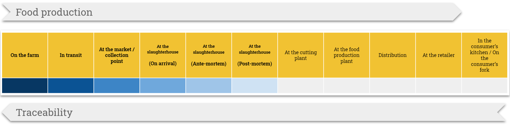
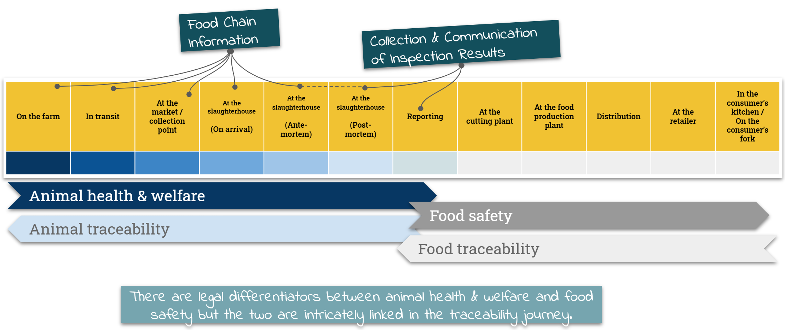

Click to open the source file: [Basic FCI & CCIR Service Timeline](https://drive.google.com/open?id=1aPd_Jrj_pZgNs2FSAHXXogvuRIwPzwZx)

## Understand the service timeline

The service timeline gives a high-level view of how Food Chain Information (FCI) and Collection & Communication of Inspection Results (CCIR) fit into a broad sequence of processes that deliver animal health & welfare and food safety and enable animal and food traceability. 

It presents the traceability lifecycle with a service design lens. This breaks animal health & welfare and food safety into a series of stages, from primary producers completing FCI documentation through to Official Veterinarians (OVs) and Meat Hygiene Inspectors (MHIs) conducting and recording slaughterhouse inspections, and on to retailers and consumers. 

Although the scope for this discovery extends only from 'On the farm' to 'At the slaughterhouse', the timeline shows subsequent stages up to the consumer to provide context and to emphasize that FCI and CCIR are a key part of a much longer traceability journey that has multiple drivers and influencers.

Given that the focus of this discovery is on the data and how information is collated and communicated, the timeline allows us to track where, when and how pieces of information are being handled and maintained and put them in the context of specific user groups, their environment, and their objectives at a given moment in time. The timeline also helps us to identify the break points where data integrity can be lost and the consequences for end-to-end traceability.

***

## Linking the service timeline to traceability

Click to open the source file: [FCI & CCIR Service Timeline and Traceability Touchpoints](https://drive.google.com/open?id=1AF0zzqF-YsWVbOHEEu8Ww0-7HJLgmryO)

### On the farm
The animal and food traceability journey starts with the primary producer. 'On the farm' is included in the scope of this discovery because FCI is completed when the producer sends their animals for slaughter, either direct to the abattoir or through a market or collection centre. The producer has a relationship with the FSA at this point, either directly by accessing FSA-published forms or via a Food Business Operator requesting FCI and additional animal health information.

### In transit
Understanding where animals have been located over time, and where and how they have been transported, is an important part of enabling true traceability. FCI is frequently associated with other livestock movement and transportation documentation and/or completed in conjunction with it. For some species, FCI has been incorporated into other systems of record.

### At the market / collection centre
Livestock can take different paths between the holding of provenance and the abattoir and the route taken can determine what happens to Food Chain Information and the integrity of the data as it is transferred between any number of keepers with differing approaches to information management. Where animals pass through a livestock market, for example, it is not uncommon for original FCI data to be reviewed and replaced by a simple acceptance declaration signed by the market handler in their own documentation.

### At the slaughterhouse (on arrival)
Food Chain Information is used to inform the acceptance of animals when they are delivered to the abattoir. FCI is requested and received by the Food Business Operator who provides it to the Official Veterinarian at the plant. The OV determines the nature of ante-mortem inspection.

### At the slaughterhouse (ante-mortem)
Food Chain Information is used to inform the inspection of animals prior to slaughter and to approve or reject their slaughter for human consumption which may identify a need further inspection activities as part of the post-mortem processing. The FCI data journey effectively ends at this point.

### At the slaughterhouse (post-mortem)
Post-mortem inspection (typically conducted by Meat Hygiene Inspectors or Poultry Inspection Assistants) forms the basis of Collection & Communication of Inspection Results. This is the source of the animal health and welfare information that the FSA and FBOs are legally required to provide to producers. In practice it is also a point where data is transferred multiple times between inspectors and the FBO using manual and/or digital means.

### Reporting
Once post-mortem inspection data has been collected there is a legal requirement to communicate it. The operation of the reporting stage is difficult to define due to it being largely determined by local practices at the FBO level and the maturity of how data is both collected and shared between inspection teams and the FBO.

***

## Operating the service
Alongside the service timeline are a number of service management activities. There is currently no one team dedicated to owning FCI and CCIR as a service; FCI and CCIR are enabled by the policies, processes and activities of Field Operations and Operations Assurance, and supported by Change & Business Implementation, FSA Legal, Veterinary Services, and FSA IT/Digital.

Click to open the source file: [FCI & CCIR as a Service](https://drive.google.com/open?id=1gwkaed0HAYhDv545KV5QRsIdbZ36igsO)

### Support - Resolving problems quickly so that people can continue to get their job done:
* Having a defined approach for managing and resolving technology incidents. This currently focusses on the IRIS system.
* Providing practical support to help people complete tasks and share knowledge and experience. This is largely driven by local and regional teams of vets and meat hygiene inspectors, and ways of working implemented by each FBO.

### Improve - Ensuring the service continues to be fit for purpose:
* Performance indicators and reports are clearly defined and have a defined purpose:

Metrics that demonstrate how well the FSA is performing against FCI and CCIR objectives are currently very difficult to define. There is no clear process ownership of FCI and CCIR as a defined set of actions; they are essentially the output from inspection activities that fall under the broader need to deliver field operations.

* Data analysis is enabled with access to relevant information, and that information is reliable:

Similarly, data analysis around the delivery of FCI and CCIR is limited partly by technology tooling that is not set up to make data transfer and re-use particularly easy; by the distributed responsibility for FCI and CCIR data collection; and by placing the onus on FBOs to define and implement many of the ways of working.