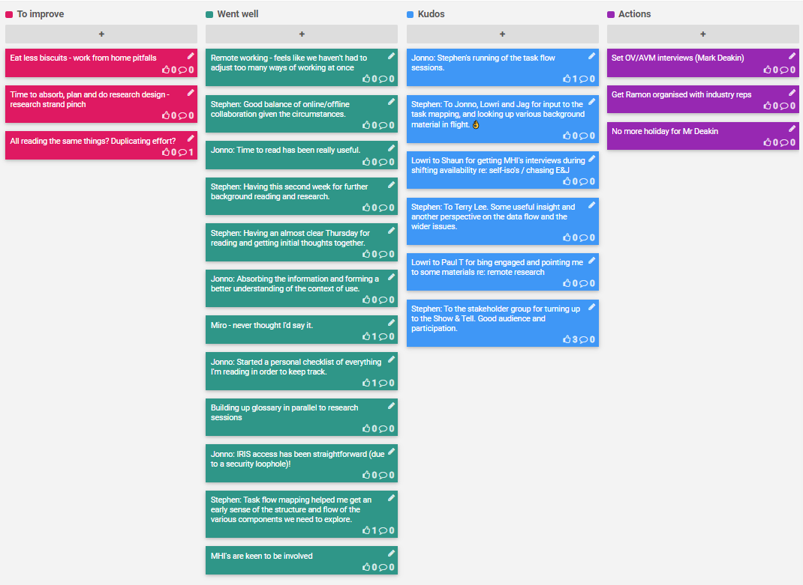

## 30 Mar - 3 Apr 2020

## Kudos

- Stephen: for running of the task flow sessions.
- Jonno, Lowri and Jag: for input to the task mapping, and looking up various background material in flight.  👌
- Shaun: for getting MHI's interviews during shifting availability re: self-isolation / chasing E&J
- Terry Lee: for some useful insight and another perspective on the data flow and the wider issues.
- Paul Turner: for being engaged and pointing me to some materials re: remote research
- The stakeholder group: for turning up to the Show & Tell. Good audience and participation.

## Went well

- Remote working - feels like we haven't had to adjust too many ways of working at once
- Good balance of online/offline collaboration given the circumstances.
- Time to read has been really useful.
- Having this second week for further background reading and research.
- Having an almost clear Thursday for reading and getting initial thoughts together.
- Absorbing the information and forming a better understanding of the context of use.
- Miro - never thought I'd say it.
- Started a personal checklist of everything I'm reading in order to keep track.
- Building up glossary in parallel to research sessions
- IRIS access has been straightforward (due to a security loophole)!
- Task flow mapping helped me get an early sense of the structure and flow of the various components we need to explore.
- MHIs are keen to be involved

## To improve

- Eat less biscuits - work from home pitfalls
- Time to absorb, plan and do research design - research strand pinch
- All reading the same things? Duplicating effort?

## Action items

- [ ] Eat less biscuits - work from home pitfalls
- [ ] Time to absorb, plan and do research design - research strand pinch
- [ ] All reading the same things? Duplicating effort?

