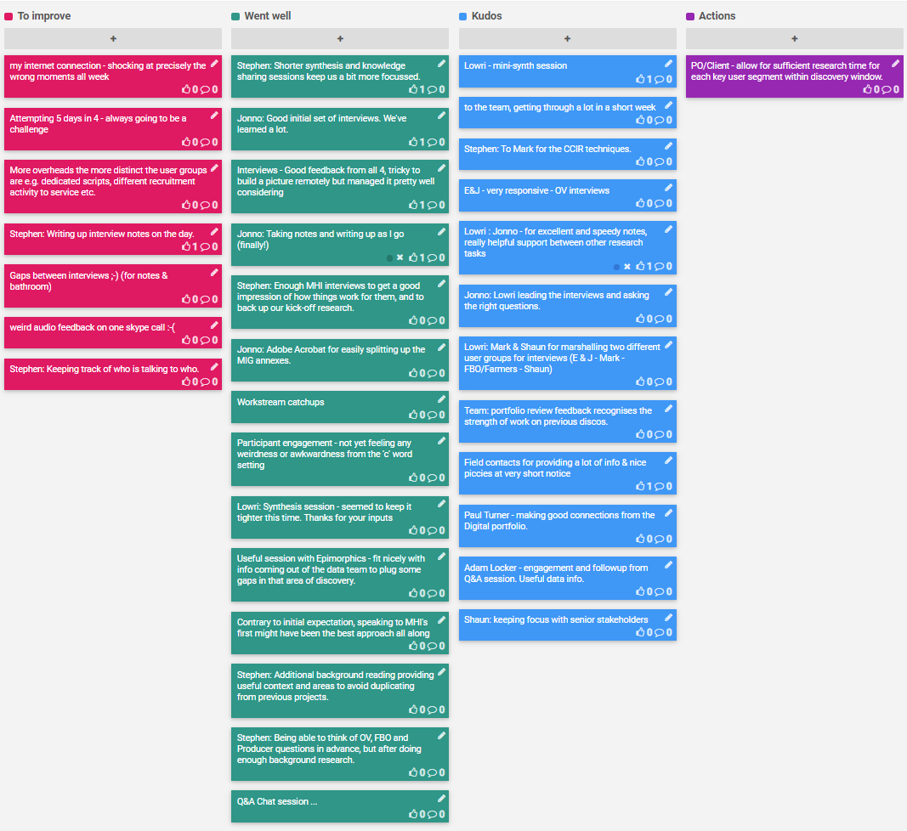

## 6-9 Apr 2020

## Kudos

- Lowri for mini-synth session
- The team for getting through a lot in a short week
- Mark for the CCIR techniques.
- E&J for being very responsive with OV interviews
- Jonno for excellent and speedy notes, really helpful support between other research tasks
- Lowri for leading the interviews and asking the right questions.
- Mark & Shaun for marshalling two different user groups for interviews (E & J  - Mark  - FBO/Farmers - Shaun)
- Team for strength of work on previous discos, as recognised in portfolio review feedback.
- Field contacts for providing a lot of info & nice piccies at very short notice
- Paul Turner for making good connections from the Digital portfolio.
- Adam Locker for engagement and followup from Q&A session. Useful data info.
- Shaun for keeping focus with senior stakeholders

## Went well

- Shorter synthesis and knowledge sharing sessions keep us a bit more focussed.
- Good initial set of interviews. We've learned a lot.
- Interviews - Good feedback from all 4, tricky to build a picture remotely but managed it pretty well considering
- Taking notes and writing up as I go (finally!)
- Enough MHI interviews to get a good impression of how things work for them, and to back up our kick-off research.
- Adobe Acrobat for easily splitting up the MIG annexes.
- Workstream catchups
- Participant engagement - not yet feeling any weirdness or awkwardness from the 'c' word setting
- Synthesis session - seemed to keep it tighter this time. Thanks for your inputs
- Useful session with Epimorphics - fit nicely with info coming out of the data team to plug some gaps in that area of discovery.
- Contrary to initial expectation, speaking to MHI's first might have been the best approach all along
- Additional background reading providing useful context and areas to avoid duplicating from previous projects.
- Being able to think of OV, FBO and Producer questions in advance, but after doing enough background research.
- Q&A Chat session ... 

## To improve

* Attempting 5 days in 4 - always going to be a challenge
* More overheads the more distinct the user groups are e.g. dedicated scripts, different recruitment activity to service etc.
* Keeping track of who is talking to who.
* Writing up interview notes on the day.
* Gaps between interviews ;-) (for notes & bathroom)
* weird audio feedback on one skype call :-(
* Mark's internet connection - shocking at precisely the wrong moments all week

## Action items

* PO/Client - allow for sufficient research time for each key user segment within discovery window.

