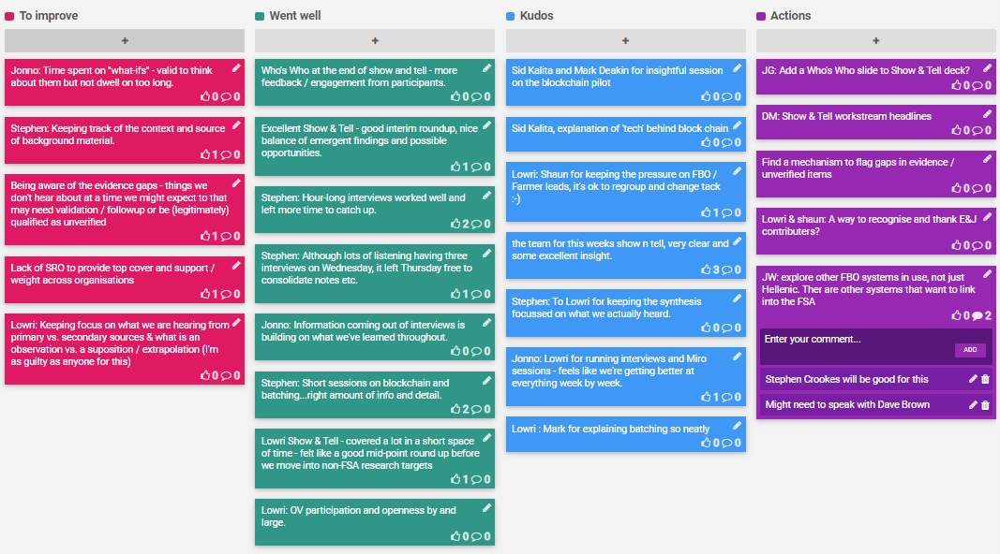

## 14-17 Apr 2020

## Kudos

- Sid Kalita and Mark Deakin for insightful session on the blockchain pilot
- Sid Kalita, explanation of 'tech' behind block chain
- Shaun for keeping the pressure on FBO / Farmer leads, it's ok to regroup and change tack :-)
- The team for this weeks show n tell, very clear and some excellent insight.
- Lowri for keeping the synthesis focussed on what we actually heard.
- Lowri for running interviews and Miro sessions - feels like we're getting better at everything week by week.
- Mark for explaining batching so neatly

## Went well

- Who's Who at the end of show and tell - more feedback / engagement from participants.
- Excellent Show & Tell - good interim roundup, nice balance of emergent findings and possible opportunities.
- Hour-long interviews worked well and left more time to catch up.
- Although lots of listening having three interviews on Wednesday, it left Thursday free to consolidate notes etc.
- Information coming out of interviews is building on what we've learned throughout.
- Short sessions on blockchain and batching...right amount of info and detail.
- Show & Tell - covered a lot in a short space of time - felt like a good mid-point round up before we move into non-FSA research targets
- OV participation and openness by and large.

## To improve

- Time spent on "what-ifs" - valid to think about them but not dwell on too long.
- Stephen: Keeping track of the context and source of background material.
- Being aware of the evidence gaps - things we don't hear about at a time we might expect to that may need validation / follow up or be (legitimately) qualified as unverified
- Lack of SRO to provide top cover and support / weight across organisations
- Keeping focus on what we are hearing from primary vs. secondary sources & what is an observation vs. a supposition / extrapolation (I'm as guilty as anyone for this)

## Action items

- [ ] JG: Add a Who's Who slide to Show & Tell deck?
- [ ] JG: Show & Tell workstream headlines
- [ ] Find a mechanism to flag gaps in evidence / unverified items
- [ ] LD/SG: A way to recognise and thank E&J contributors?
- [ ] JW: explore other FBO systems in use, not just Hellenic. There are other systems that want to link into the FSA