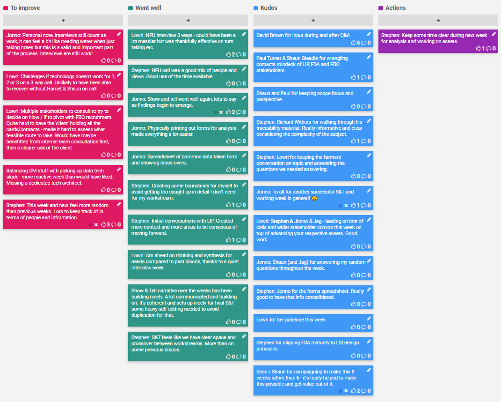

## 20-24 Apr 2020

## Kudos

- David Brown for input during and after Q&A
- Paul Turner & Shaun Gleadle for wrangling contacts rolodeck of LIP, FSA and FBO stakeholders.
- Shaun and Paul for keeping scope focus and perspective.
- Richard Withers for walking through his traceability material. Really informative and clear considering the complexity of the subject.
- Lowri for keeping the farmers' conversation on topic and answering the questions we needed answering.
- To all for another successful S&T and working week in general!  😀
- Stephen & Jonno & Jag - leading on lots of calls and wider stakeholder convos this week on top of advancing your respective assets. Good work
- Shaun (and Jag) for answering my random questions throughout the week.
- Jonno for the forms spreadsheet. Really good to have that info consolidated.
- Lowri for her patience this week
- Stephen for aligning FSA maturity to LIS design principles
- Sean / Shaun for campaigning to make this 8 weeks rather than 6 - it's really helped to make this possible and get value out of it.

## Went well

- NFU interview 3 ways - could have been a lot messier but was thankfully effective on turn taking etc.
- NFU call was a good mix of people and views. Good use of the time available.
- Show and tell went well again, lots to say as findings begin to emerge.
- Physically printing out forms for analysis made everything a lot easier.
- Spreadsheet of common data taken form and showing cross-overs.
- Creating some boundaries for myself to avoid getting too caught up in detail I don't need for my workstream.
- Initial conversations with LIP. Created more context and more areas to be conscious of moving forward.
- Am ahead on thinking and synthesis for needs compared to past disco's, thanks to a quiet interview week
- Show & Tell narrative over the weeks has been building nicely. A lot communicated and building on. It's coherent and sets up nicely for final S&T - some heavy self-editing needed to avoid duplication for that.
- S&T feels like we have clear space and crossover between workstreams. More than on some previous discos.

## To improve

- Personal note, interviews still count as work, it can feel a bit like treading water when just taking notes but this is a valid and important part of the process. Interviews are still work!
- Challenges if technology doesn't work for 1, 2 or 3 on a 3 way call. Unlikely to have been able to recover without Harriet & Shaun on call
- Multiple stakeholders to consult to try to decide on hiow / if to pivot with FBO recruitment. Quite hard to have the 'client' holding all the cards/contacts - made it hard to assess what feasible route to take. Would have maybe benefitted from internal team consultation first, then a clearer ask of the client
- Balancing DM stuff with picking up data tech slack - more reactive week than would have liked. Missing a dedicated tech architect.
- This week and next feel more random than previous weeks. Lots to keep track of in terms of people and information.

## Action items

- [ ] SD: Keep some time clear during next week for analysis and working on assets.