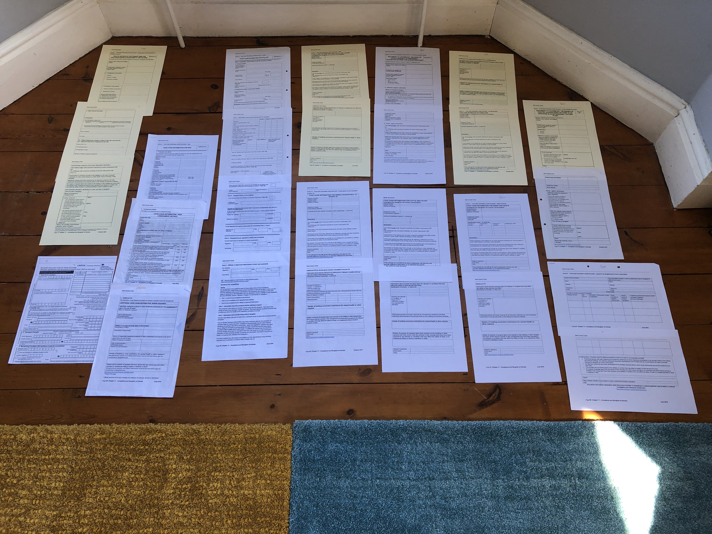
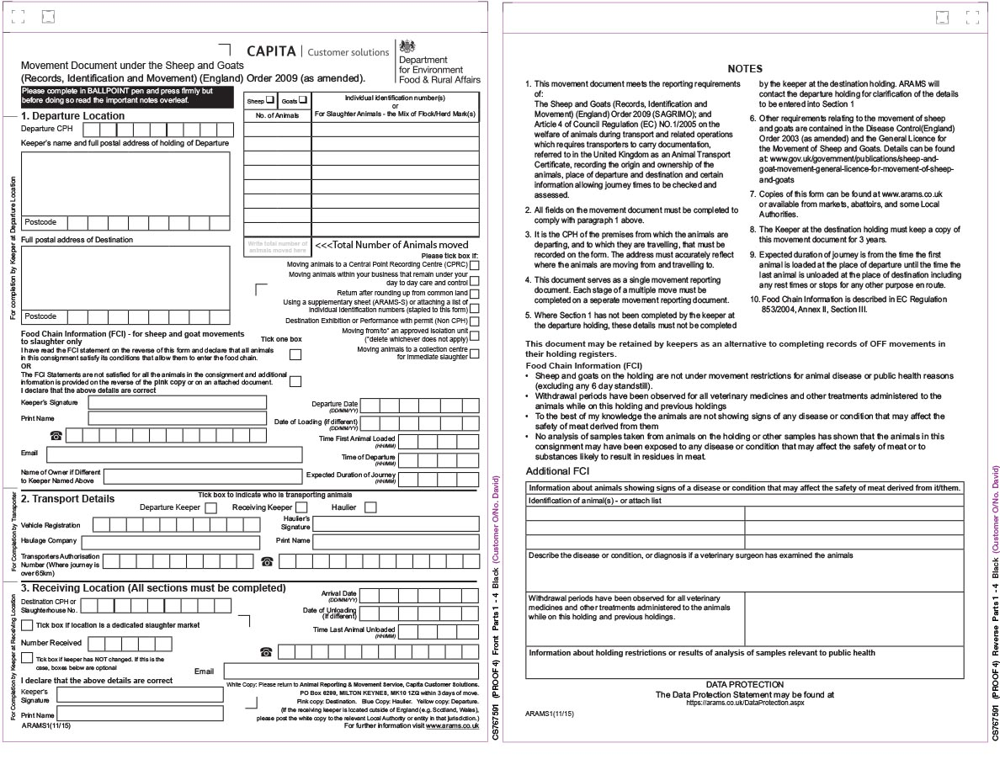
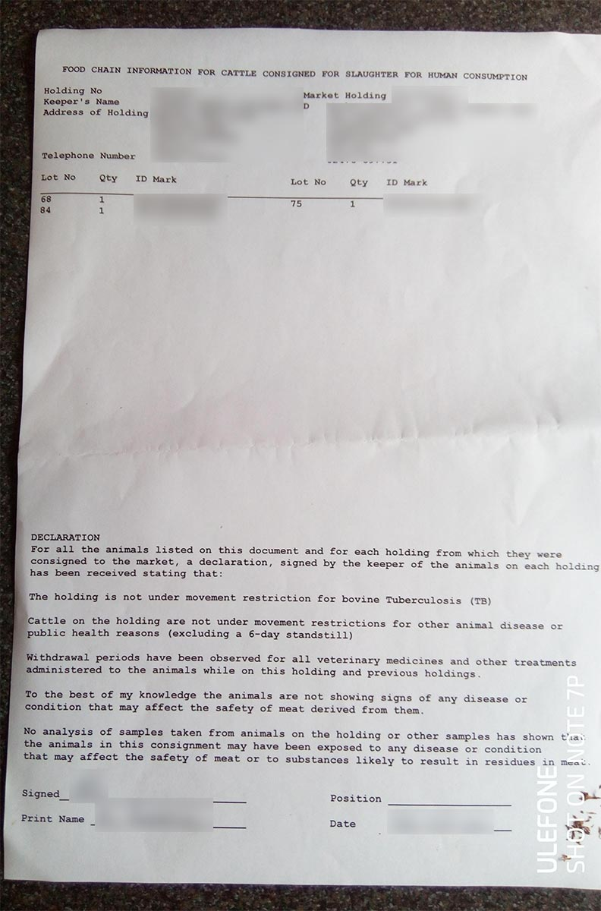
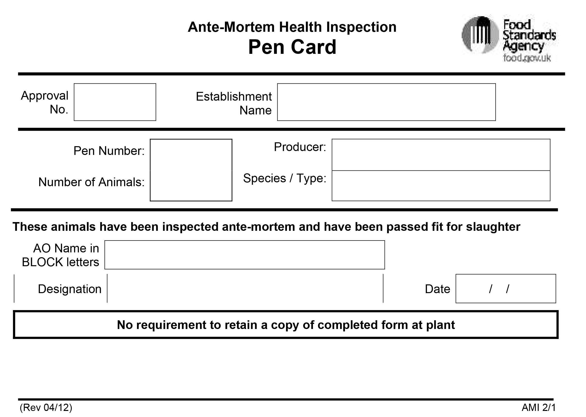
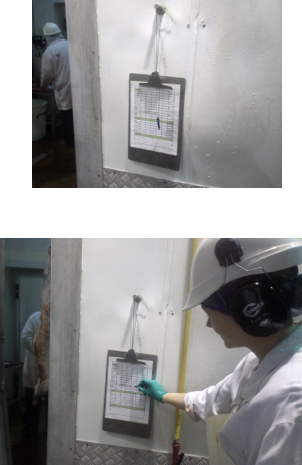
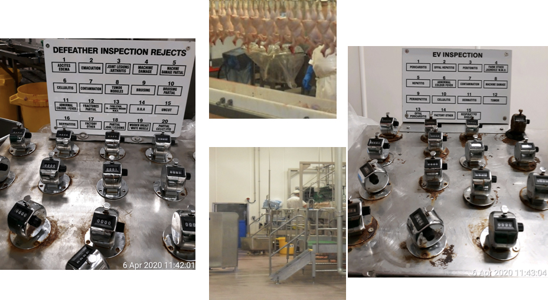
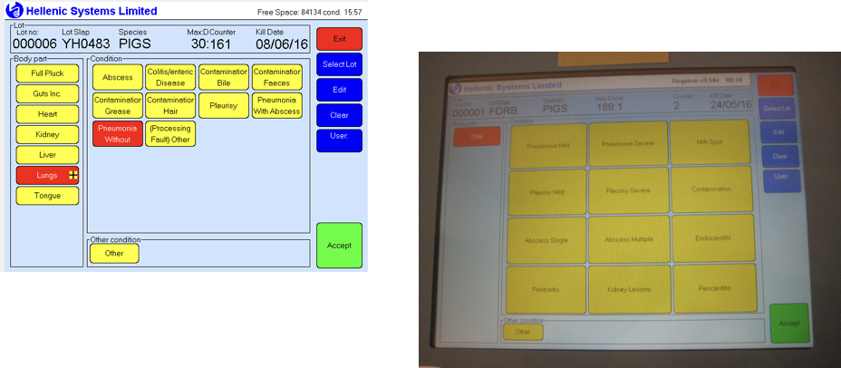
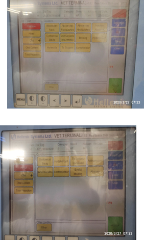
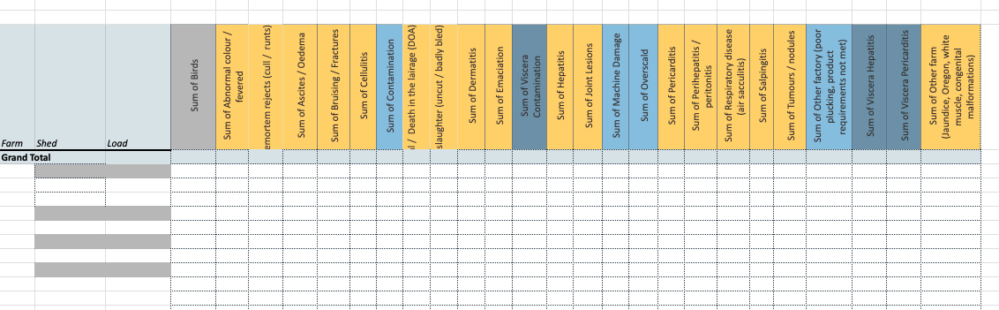

Each tool is presented in the following format. Under each main heading are the tools that accompany that part of the process.

```
    # WHERE IN THE PROCESS
    
    ## JOB TO BE DONE
    
    ### TITLE
    
    Used by: **XYZ**
    
    Content - an explanation of how the tool is used/why
    IMAGE
    
    ### Pains
    
    * ABC
    * DEF 
    
    ### Opportunities
    
    * ABC
    * DEF
```

  

# Contents
- **[Before arrival at plant](#before-arrival-at-plant)**
  * [Complete FCI](#complete-fci)
    + [FCI Model Document (FSA/Third-party)](#fci-model-document--fsa-third-party-)
    + [ARAMS (Animal Reporting and Movement Service) form](#arams--animal-reporting-and-movement-service--form)
    + [Third party apps](#third-party-apps)
    + [Market document](#market-document)
- **[Arrival at plant](#arrival-at-plant)**
  * [Confirm incoming livestock](#confirm-incoming-livestock)
    + [Kill plan](#kill-plan)
    + [Pen card](#pen-card)
  * [Communicate findings to inspectors on the line](#communicate-findings-to-inspectors-on-the-line)
    + [FCI](#fci)
    + [Text/instant message](#text-instant-message)
- **[Ante-Mortem Inspection](#ante-mortem-inspection)**
    + [Ante-Mortem inspection record sheet & clipboard](#ante-mortem-inspection-record-sheet---clipboard)
    + [Notebooks and memory](#notebooks-and-memory)
- **[Post-Mortem Inspection](#post-mortem-inspection)**
  * [Collect data](#collect-data)
    + [Clicker board](#clicker-board)
    + [Chinagraph pencil and laminated sheet](#chinagraph-pencil-and-laminated-sheet)
    + [Terminals with third-party software (Hellenic)](#terminals-with-third-party-software--hellenic-)
    + [Clipboard + FSA printed forms](#clipboard---fsa-printed-forms)
    + [Whiteboard](#whiteboard)
- **[Recording data](#recording-data)**
  * [Moving the data from line to back-office](#moving-the-data-from-line-to-back-office)
    + [Paper form and clipboard & clicker boards to whiteboards](#paper-form-and-clipboard---clicker-boards-to-whiteboards)
    + [Spreadsheet](#spreadsheet)
  * [Entering data into FSA (IRIS) system](#entering-data-into-fsa--iris--system)
    + [IRIS](#iris)
    + [Hellenic](#hellenic)
- **[Feeding back to source](#feeding-back-to-source)**
  * [FBO](#fbo)
    + [CSV via email](#csv-via-email)
  * [Farmer/Producer](#farmer-producer)
    + [Fax or email over missing data](#fax-or-email-over-missing-data)
    + [Verbal feedback](#verbal-feedback)

***

# Before arrival at plant
## Complete FCI
### FCI Model Document (FSA/Third-party)
Used by: **Farmers/Producers**
These forms make up the FCI for individual species. Some of the questions go into IRIS when creating a new FCI (FCI Header), however not all of them are entered (refer to (IRIS user flow)[interaction-flow]).

Documents are available from the MIG. Similar questions are asked for every species, however the wording and layout is different. A full comparisson of FCI forms available can be found on the FCI (Forms Comparison page)[Forms-Comparison].

None of the model documents contain any official FSA branding. 

The content of the model documents used by third parties to include the FCI requirements including the ARAMS movement form and third-party apps.

[](Forms-Comparison)

### Pains
* The design is different between forms/species - the layout is different
* Language is different for similar/the same questions, across different forms.  

### Opportunities
* Standardising the design could improve the usability and therefore make easier for OVs to find and enter information across sites/species/forms.
* Using the same language will present a common form of communication to users. Forms could be kept in-step if needed to change.
* Branding FSA branding to the forms will make them look more official and professional.
* Communicating to producers/farmers, and FBOs that the FCI is an important document would improve relations with these stakeholders and could lead to more reliable data.

***

### ARAMS (Animal Reporting and Movement Service) form
Used by: **Farmers/Producers/FBOs**
The ARAMS form is an example of a third party form that must also be completed by farmers/producers for the purposes of movement tracking. This is a professional looking form that is clearly laid out. The FCI is marked specifically on the form and is a series of declarations to be signed and dated by the person completing. It contains the same information as the other FCI forms. The full form content can be found alongside the FCI model documents in the FCI [Forms Comparison page](Forms-Comparison).



#### Pains
* We do not know the extent of communication between the FSA and the Animal Reporting and Movement Service. Therefore we cannot be certain that any changes to FCI will be reflected in the ARAMS form.

### Opportunities
* Co-operation with ARAMS could improve links to industry and ensure up-to-date forms are always used.
* Use of an API for FCI completion could feed directly into ARAMS and back to IRIS.
* The style and stardardised elements and layout of the form could be used as a starting point to stardardising any FSA forms.

***

### Third party apps
#### AgriWebb & NLMD (by Shearwell Data Ltd)
Used by: **Farmers/Producers**
Third party farming apps that include ARAMS forms and therefore, FCI information.
NLMD is used for movement and online records.

[AgriWebb website](https://www.agriwebb.com/uk/features/individual-livestock-identification/)
[NLMD App website](https://lt.nlmd.co.uk/Default.aspx)

### Pains
* No integration with FSA systems, users may be duplicating work if they are also completing a paper FCI form.
* As far as our research shows, there is little to no dialogue between these companies (these are two of the larger farming app developers).

### Opportunities
* Integration with IRIS or FSA systems could make this easier for users to complete and provide more accurate and timely data.
* Opportunity to leverage the bigger software providers: by pushing FCI and providing a method of integration for providers, vendors could use this as a selling point and increase the digitisation of FCI data (using an API).
  * An API would be the way to go with this, as third-parties could build the integrations and users can continue to use the apps and software they currently use.

***

### Market document 
Used by: **Farmers/Producers**
A third-party document based on the model documents. However, the format and design can be completely different. In the example we were given the market document was little more than a plain paper with information printed on it.



#### Pains
* Inconsistent format means that OVs have to search for the pertinent information, it is not easily available at a glance and therefore will add seconds to data entry. These seconds could build up into a significant amount of time over the course of a day and week.
* Inconsistent format allows for data to be missed from the form whether the current form or updated forms. 
* Because the FSA do not own these forms and have little input, there is no version control. Important data could be missing.

### Opportunities
* Encourage markets to adopt standardised FSA forms, including producer identification details.

***

# Arrival at plant
## Confirm incoming livestock
### Kill plan
Used by: **FBO/OV**
The kill plans tells the OV how many animals will be presented for slaughter and when they will be slaughtered. The OV should be able to track what animals are on the line at any point and correlate with the inspection recordings.
The OV will usually get to see a kill plan on the day of slaughter (but up to a week before for poultry and larger plants where the production chain is wholly owned/controlled).

#### Pains
* OV does not know when this form may be received.
* Format could be different.

### Pen card
Used by: **OV (Completed by FBO / OV)**
A card (usually a laminated sheet) in front of each pen that is completed by the FBO. It contains the intake of animals and can aid the OV when comparing actual numbers of animal against the FCI and kill plan.



***

## Communicate findings to inspectors on the line
### FCI
Used by: **OV**
The haulier will provide the OV (via the FBO in some cases) with a completed FCI. If it is not completed correctly the OV can stop the slaughter from starting. 

- It must be completed fully and correctly before slaughter can begin, though the OV will usually accept a completed FCI in whatever form it comes in. 
- In most cases it is most likely to be printed.

The FCI is used to check the incoming animals against that stated, ensure all animals are fit for entry to the food chain and inform the OV’s inspection plan to determine whether the animals are fit for slaughter.

#### Pains
* The format can vary massively, this can make data entry inefficient and affect the reliability of the data.

### Text/instant message
Used by: **OV/MHI** 
We heard anecdotely that some OVs will communicate certain findings down the line to inspectors, sometimes by shouting and sometimes by texting. This will be specific information for inspectors to keep an eye out for.

***

# Ante-Mortem Inspection
### Ante-Mortem inspection record sheet & clipboard
FSA form, completed by the OV, transferred to the back office for entry into IRIS. We heard this could be a legacy instrument. There is not a requirement to complete this form - it is used as an aide-memoire for OVs.



### Notebooks and memory
As with the above ante-mortem inspection recording sheets, the OV will use a variety of tools to record their findings for ante-mortem.
#### Pains
* Non-standard notebooks.
* There is an obvious risk to data integrity here that we are relying on an individual to remember specifics of what they saw during a long shift and seeing potentially thousands of beasts.

***

# Post-Mortem Inspection
## Collect data
### Clicker board
Used by: **MHI**
A very rudimentary board with clickers attached (a hand tally counter bolted to a metal sheet). A sheet with common problems will be nearby to show which clicker relates to which problem. Only a limited number of problems can be recorded due to the space need and so this then falls on the inspector to remember any problems outside of the available clickers (though as they are not likely to be common it is more likely that the inspector will remember this).




#### Pains
* Prone to rust and breaks often. When breakages do occur, we heard that clickers are not replaced in a timely manner, so condition information may go unrecorded.
* Clicker systems are completely analogue - they are not digitally connected to anything else, and so data has to be manually transcribed throughout the day.
* The FBO often controls the data collection. The integrity of the data could suffer due to multiple manual handovers of data.
* Inconsistent layouts between plants

#### Opportunities
* Digitally connect to feed into IRIS
* Work with FBOs to give standard set of options and formats for recording condition data on the inspection line, making implementation more straightforward and transferable between plants.

***

### Chinagraph pencil and laminated sheet
Used by: **MHI**
The chinagraph pencil and laminated sheets are used by inspectors on the line to record any findings. They are used because of the in-plant conditions and will not degrade or become unusable like paper would.

#### Pains
* User must leave position on the line, depending on the set-up of their station, in order to fill this in.
* FBOs can come around and collect data and wipe clean - increasing handovers and degrading the data integrity.

#### Opportunities
* Tried and tested technology for use in-plant, on the line.

***

### Terminals with third-party software
Used by: **MHI/FBO**
Terminal system that is owned and operated by the FBO. Feeds directly into IRIS. Hellenic is the most popular system used by FBOs. 

The terminal is on the line. The MHI hits the large, coloured buttons on the screen when they find a problem with the animal - offal, carcase, or other area. Batches are automatically set on the system, meaning this is one less thing for the MHI to think about.

We heard only positive things during our interviews with OVs and MHIs.




#### Pains
* Minimal communication between Hellenic Systems and the FSA (that our research showed). 
  * A bug that was not fixed for several months meant that data had been lost and was also transferred by the FBO to a CSV for input by OV later on, increasing data integrity risk and rechargeable cost of inspection.
  * No incentive on the part of Hellenic to fix issues and/or integrate with FSA software.
* Owned and maintained by the FBO, and customised to their specifications.

#### Opportunities
* Work closely with an industry leading company to influence the data collection and transfer.
* While only two FBOs use Hellenic, they have a very high throughput, and so digital data collection could be trialled in these plants to prove whether or not the data integrity is improved.

***

### Clipboard + FSA printed forms
Used by: **MHI**
The clipboard and printed forms will be near to the line. The MHI will have to step away from their station in order to complete this. It is an analogue solution and the forms may be legacy (this was suggested to us during a user interview).
#### Pains
* With many other methods of on-the-line data collection, this data can be collected by the FBO staff, handled and handed back as a printed out spreadsheet for entry to IRIS by the OV. This could impact the data integrity.

***

### Whiteboard
Used by: **MHI**
Much like the other analogue systems found on the line, the white board is used by the MHI to mark down any findings during a batch. This is then transferred to paper either by FSA staff or the FBO, in which case it is then handled and passed back to the OV for data entry.
#### Pains
* FBO can collect data and then wipe it before the data is recorded by FSA or entered. Data can be lost, and we heard in some cases that it can be entered from memory after the fact - impacting the data integrity.
* FSA does not control the boards.

***

# Recording data
## Moving the data from line to back-office
### Paper form and clipboard & clicker boards to whiteboards
As stated earlier, the data can be collected by FBO staff for entry into their systems before it is handed back to the FSA staff. This is not good as the data integrity can suffer. It is then uncontrolled and is open to tampering and unnecessary human error. If the OV collects the data directly from the line there are still extra hand-offs created. Data can become corrupted and therefore unreliable when copying down by hand and moving to different formats. This may not be a reliable method of moving data.

#### Pains
* FBO handling data unnecessarily.
* No standard way of working.

#### Opportunities
* Introduce standard operating procedures in relation to the collection and transport of data between the line and back office. A standardised approach to this would encourage good working practices for FSA staff and enable data integrity assurance.
* Encourage FBOs not to handle this data before the FSA has had it.

***

### Spreadsheet
Used by: **OV (supplied by FBO)**
Data goes from one of the above methods into an FBO system. The data is then printed out by the FBO and handed back to the OV for entry into IRIS.



#### Pains
* The format of the spreadsheets is in a format that does not easily correlate to IRIS. This makes the OV's job more difficult.

#### Opportunity
* By taking control of the data, the integrity and reliability of it could be improved.

***

## Entering data into FSA (IRIS) system
### IRIS
Used by: **OV, FSA staff**
FSA owed system. OV manually enters FCI and (unless Hellenic is used) CCIR data from the given method.
Used in back-office FSA thin client in-plant. 

* [IRIS Interaction Flow](Interaction-flow)

#### Pains
* Usability and accessibility issues
* Not universally available on different devices

#### Opportunities
* An API feeding into this could improve reliability of data, make it easier for all users including OVs, FBO staff, markets, and producers and farmers to enter data.
* A full usability study is required to see what issues exist for users however:
  * Minor improvements to the UI could make for a better experience
  * Making the system available on tablets and mobile devices could improve the entering of data by OVs.

***

### Hellenic
Hellenic has a direct link into IRIS for the purposes of CCIR. Findings recorded on the line by MHIs will be fed into IRIS. We heard that "when it works, it's great" - a sentiment that has been echoed about the use of Hellenic on the line too. We also heard that the feed had gone down a few years ago meaning that some of the data may have been lost/incorrectly entered. This would certainly have caused more work for the OVs during data entry. From interviews it seems the issue was not discovered immediately, and once it had been Hellenic did not have an incentive (financial or pressure from the FBO) to fix it.

***

# Feeding back to source
## FBO
### CSV via email
Used by: **FSA (creator)/FBO (consumer)**
Each night IRIS sends the FBO the completed FCI/CCIR results in a CSV format. This is a SQL scheduled job. This is how the data is returned to the FBO.
#### Pains
* It is then down to the FBO to return results to the farmers/producers. Our research suggests that this is not happening very often.

#### Opportunities
* This has proven that feedback can be automated. This method could be extended to bring farmers/producers directly into the feedback loop by allowing third-party applications to build connections to IRIS via an API.

***

## Farmer/Producer
### Fax or email over missing data
Used by **Farmers/Producers (creators)/OVs(consumer)**
If the farmer/producer hands in an incompleted or incorrect FCI, the OV will not allow the batch to be slaughtered. And a request for this updated will be given to the origin of the livestock for this missing or correct information. This will be returned via email or fax to the OV.

***

### Verbal feedback
Used by: **Farmers/Producers/OVs**
As the farmer does not usually receive feedback from the FBO, in some instances they will ask the OV for feedback if animals were not slaughtered. This will occur when the farmer/producer is delivering animals in the plant's lairage or in the FSA office.
#### Pains
* The farmers/producers are not receiving information from the FBO or the FSA directly. 
#### Opportunities
* There is demand from farmers and producers to receive this information.

