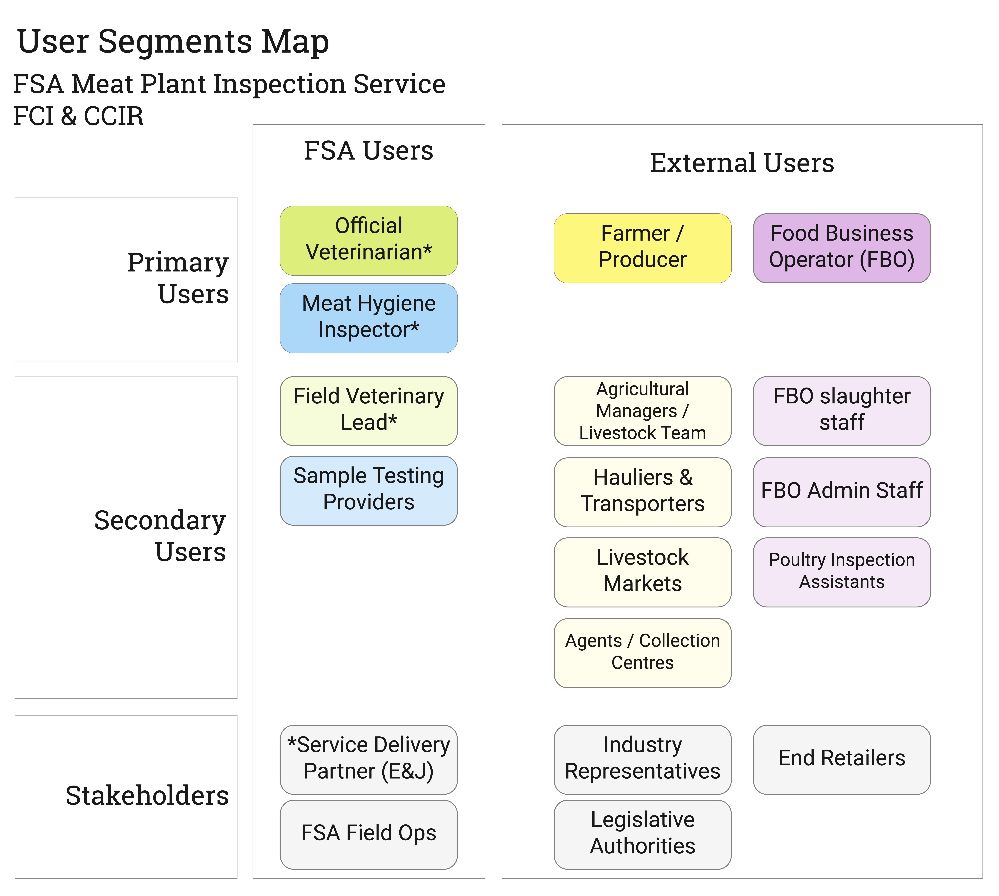
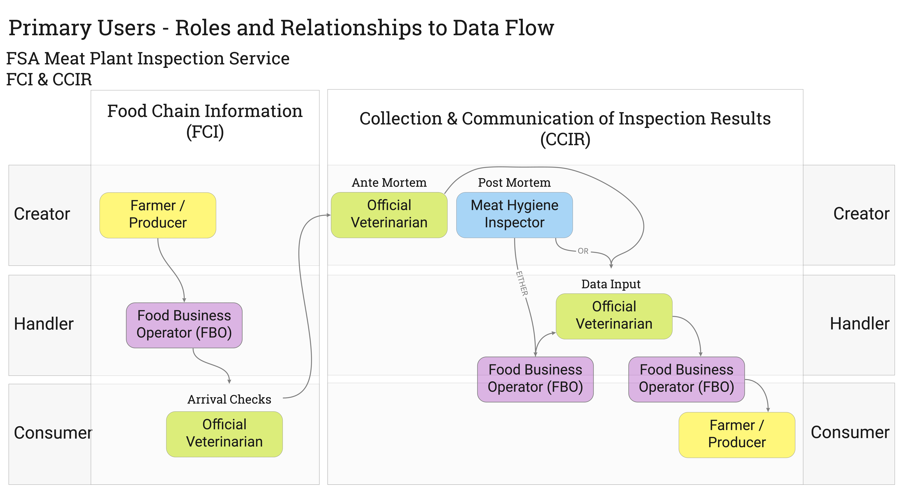

The user segments identified for targeted research in this discovery cover the roles and/or teams involved in the collection and communication of FCI and CCIR data. 

Primary user roles are directly involved in tasks spanning creation, handling or consumption of FCI data or documents, or tasks spanning creation, handling or consumption of CCIR data.
These are the main candidates for user research.  
Their relationship to the data and task flow is detailed in the [Roles and Relationships to Data Flow](#roles-to-data-flow)

Research observations from Primary user group interviews are synthesised into Personas.
[Personas](personas) for priority user segments are further elaborated with [user needs](user-needs). 

Secondary user roles encompass occasional supporting casts or adjacent actors who are important to consider alongside the core user groups.

## Roles and Relationships to Data Flow

FCI data is primarily created and supplied to the FBO (Abattoir) by the Farmer, usually in conjunction with offical movement documents such as ARAMS (DEFRA) or other FBO created templates, as permitted by guidance.

The FCI data is checked for completeness ('handled') by the FBO and prepared for the OV along with a kill plan and estimated arrival time.

The FCI information supplied is reviewed a second time by the OV and any omissions or issues flagged to the FBO. All being well the OV will 'consume' it by using the information contained in it to guide their Ante Mortem inspections. They will also transpose some FCI identifying information (e.g. county parish holding and animal passports) into official AM documentation.

These Ante Mortem inspections now create new observations, or data, known as 'CCIR' - new and original information 'created' by the OV.

From the OV, the task flow (but not AM data flow) is to the MHI as the 'creator' of Post Mortem inspection data. This data may be 'handled' i.e. collected either by the FBO or the MHI's, depending on the local arrangement.
The FBO may have a digital system such as hellenic which is capturing ('handling) the data created by the MHI's on the PM inspection points, before it is printed out by the FBO and handed back to the FSA (OV or MHI) for entry into the IRIS system. At this 'handling' stage, the FBO might also be consuming that data in real time, e.g. pairing it with their own grading and weighing information in order to bill the farmer appropriately.

The ultimate 'consumer' of the data, once the FSA have entered it into IRIS and passed it back to the ('handler') FBO's, is the Farmer. The farmer will 'consume' the CCIR data to inform the health and productivity of his herd and increase the prices they achieve at slaughter. 

